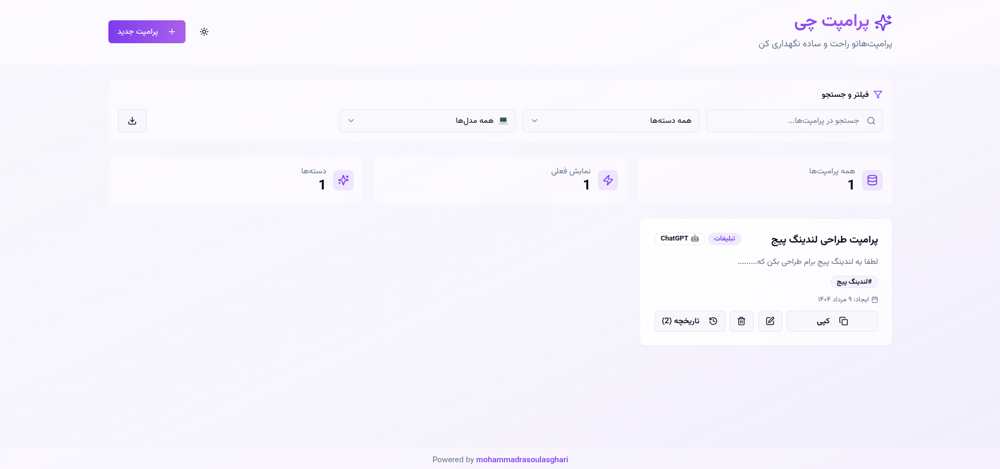
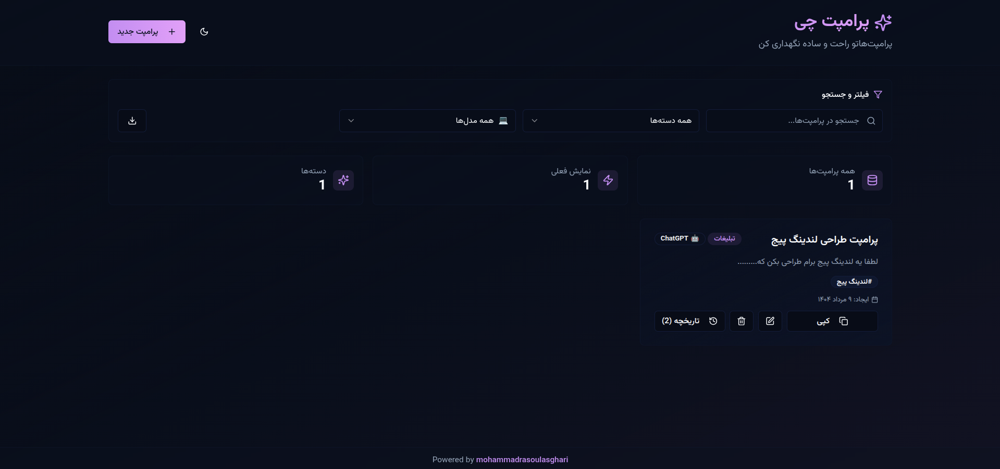
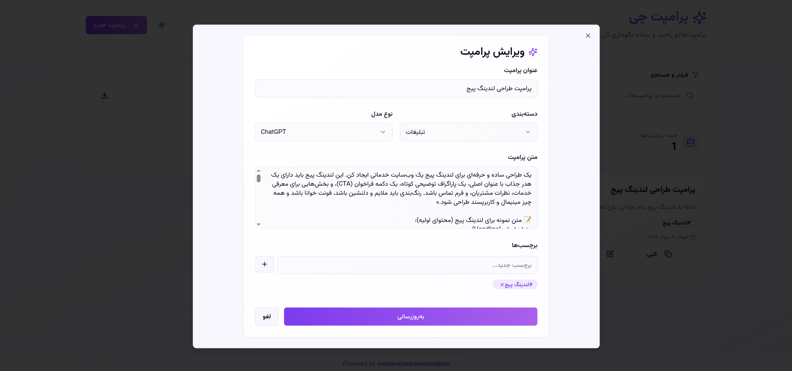
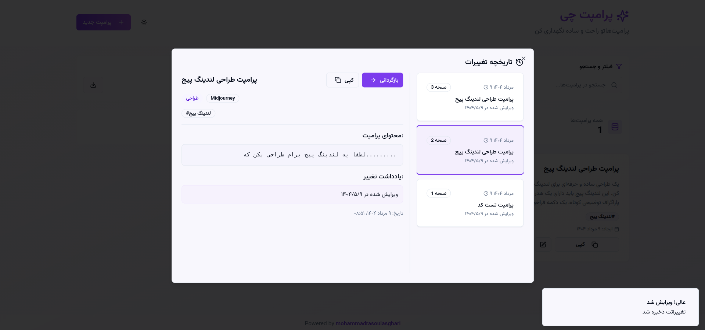

<div align="center">
   
# 🚀 Quick Prompt Box | جعبه پرامپت سریع

</div>

<div align="center">


**ابزار سریع و قدرتمند مدیریت پرامپت‌های AI | Fast & Powerful AI Prompt Management Tool**

[](https://reactjs.org/)
[](https://www.typescriptlang.org/)
[](https://tailwindcss.com/)
[](https://vitejs.dev/)

[🐛 **گزارش مشکل**](https://github.com/mohammadrasoulasghari/quick-prompt-box/issues) 

</div>

---

## ⚡ نصب فوری

یک دستور ساده برای نصب و راه‌اندازی:

```bash
bash <(curl -fsSL https://raw.githubusercontent.com/mohammadrasoulasghari/quick-prompt-box/main/setup.sh)
```

> 🚀 **فقط یک دستور!** Docker خودکار نصب می‌شود، پورت را انتخاب کنید و ظرف چند دقیقه آماده است.

---

## 🎯 درباره پروژه

**Quick Prompt Box** یک ابزار سریع، قدرتمند و کاربرپسند برای مدیریت، ذخیره‌سازی و سازماندهی پرامپت‌های مختلف AI است. این پروژه به گونه‌ای طراحی شده که تجربه کاری شما با مدل‌های مختلف هوش مصنوعی را بهبود بخشد و به شما کمک کند تا پرامپت‌های خود را به صورت حرفه‌ای و سریع مدیریت کنید.

### 🌟 ویژگی‌های کلیدی

- 🗂️ **دسته‌بندی هوشمند**: سازماندهی پرامپت‌ها براساس دسته‌بندی‌های مختلف
- 🤖 **پشتیبانی از مدل‌های مختلف**: ChatGPT، Claude، Gemini، Midjourney، DALL-E و بیشتر
- 📝 **ویرایش آسان**: امکان ویرایش سریع و آسان پرامپت‌ها
- 🔍 **جستجوی پیشرفته**: پیدا کردن سریع پرامپت‌های مورد نظر
- 📚 **تاریخچه نسخه‌ها**: ذخیره و بازگردانی نسخه‌های قبلی
- 🌙 **تم تاریک/روشن**: تجربه کاری راحت در هر شرایط نوری
- 🔄 **ذخیره‌سازی محلی**: تمام داده‌ها در مرورگر شما محفوظ می‌ماند
- 📱 **طراحی ریسپانسیو**: سازگار با تمام دستگاه‌ها
- 🇮🇷 **پشتیبانی کامل از فارسی**: طراحی RTL و محتوای فارسی

## 💡 چرا Quick Prompt Box؟

### 🎯 برای توسعه‌دهندگان
- ذخیره پرامپت‌های کاربردی برای پروژه‌های مختلف
- دسته‌بندی براساس زبان‌های برنامه‌نویسی
- مدیریت پرامپت‌های Code Review و Documentation

### 🎨 برای طراحان
- نگهداری پرامپت‌های خلاقانه Midjourney و DALL-E
- دسته‌بندی براساس سبک‌های مختلف طراحی
- اشتراک‌گذاری ایده‌های بصری

### 📝 برای نویسندگان و بازاریابان
- مجموعه‌ای از پرامپت‌های تولید محتوا
- الگوهای مختلف نوشتاری
- پرامپت‌های تخصصی برای SEO و Social Media

### 🎓 برای دانشجویان و محققان
- سازماندهی پرامپت‌های تحقیقاتی
- ذخیره منابع علمی و آکادمیک
- مدیریت پروژه‌های دانشگاهی

## 🚀 شروع سریع

### روش ۱: نصب خودکار با Docker (پیشنهادی)

```bash
# نصب و راه‌اندازی با یک دستور
bash <(curl -fsSL https://raw.githubusercontent.com/mohammadrasoulasghari/quick-prompt-box/main/setup.sh)
```

✅ **ویژگی‌ها:**
- نصب خودکار Docker
- انتخاب پورت دلخواه
- اجرای فوری بدون نیاز به تنظیمات

### روش ۲: نصب دستی با Docker

```bash
# Clone کردن پروژه
git clone https://github.com/mohammadrasoulasghari/quick-prompt-box.git
cd quick-prompt-box

# اجرا با Docker
docker compose up -d
```

### روش ۳: نصب Development

**پیش‌نیازها:**
- Node.js (نسخه 18+)
- npm یا yarn

```bash
# Clone کردن پروژه
git clone https://github.com/mohammadrasoulasghari/quick-prompt-box.git
cd quick-prompt-box

# نصب Dependencies
npm install

# اجرای پروژه در حالت Development
npm run dev
```

### 🌐 دسترسی به اپلیکیشن
- **Docker**: `http://localhost:3131` (یا پورت انتخابی)
- **Development**: `http://localhost:5173`

## 📖 نحوه استفاده

### ➕ اضافه کردن پرامپت جدید
1. روی دکمه **"پرامپت جدید"** کلیک کنید
2. فرم را با اطلاعات پرامپت پر کنید:
   - **عنوان**: نام مشخص برای پرامپت
   - **توضیحات**: توضیح کوتاه درباره کاربرد
   - **دسته‌بندی**: انتخاب دسته مناسب
   - **نوع مدل**: انتخاب مدل AI مورد نظر
   - **متن پرامپت**: متن اصلی پرامپت
3. روی **"ذخیره"** کلیک کنید

### 🔍 جستجو و فیلتر
- از نوار جستجو برای پیدا کردن پرامپت‌های خاص استفاده کنید
- از فیلترهای دسته‌بندی و نوع مدل استفاده کنید
- نتایج به صورت Real-time نمایش داده می‌شوند

### ✏️ ویرایش و مدیریت
- روی عنوان هر پرامپت کلیک کنید تا وارد حالت ویرایش شوید
- از منوی سه‌نقطه برای دسترسی به گزینه‌های بیشتر استفاده کنید
- تاریخچه نسخه‌ها را مشاهده و بازگردانی کنید

## 🛠️ تکنولوژی‌های استفاده شده

| تکنولوژی | نسخه | کاربرد |
|-----------|------|---------|
| **React** | 18.3.1 | کتابخانه اصلی UI |
| **TypeScript** | Latest | Type Safety |
| **Vite** | Latest | Build Tool |
| **Tailwind CSS** | Latest | Styling Framework |
| **Shadcn/ui** | Latest | Component Library |
| **Lucide React** | Latest | Icon Library |
| **React Hook Form** | 7.53.0 | Form Management |
| **Zod** | Latest | Schema Validation |

## 🎨 تصاویر


### صفحه اصلی - تم روشن


### صفحه اصلی - تم تاریک  


### فرم اضافه کردن پرامپت


### نمایش تاریخچه نسخه‌ها



## 🤝 مشارکت در پروژه

مشارکت شما در بهبود این پروژه بسیار ارزشمند است! 

### روش‌های مشارکت:
1. **Fork** کردن پروژه
2. ایجاد **Branch** جدید برای فیچر یا بهبود
3. **Commit** کردن تغییرات
4. **Push** به Branch خود
5. ارسال **Pull Request**

### راهنمای توسعه:
```bash
# Clone کردن Fork شده
git clone https://github.com/your-username/quick-prompt-box.git

# ایجاد Branch جدید
git checkout -b feature/new-feature

# پس از تغییرات
git add .
git commit -m "Add: new feature description"
git push origin feature/new-feature
```

### کدنویسی استاندارد:
- از **TypeScript** استفاده کنید
- **Component-based** کدنویسی کنید
- **Responsive Design** را رعایت کنید
- **Comments** مناسب اضافه کنید

## 🐛 گزارش مشکلات

اگر با مشکلی مواجه شدید یا پیشنهادی دارید:

1. [Issues](https://github.com/mohammadrasoulasghari/quick-prompt-box/issues) را بررسی کنید
2. اگر مشکل تکراری نیست، Issue جدید ایجاد کنید
3. توضیحات کامل و گام‌های تکرار ارائه دهید

## 📄 مجوز

این پروژه تحت مجوز **MIT** منتشر شده است. برای اطلاعات بیشتر فایل [LICENSE](LICENSE) را مطالعه کنید.

## 👨‍💻 سازنده

<div align="center">

**Mohammad Rasoul Asghari**

[](https://github.com/mohammadrasoul-asghari)
[](https://linkedin.com/in/mohammadrasoul-asghari)

*"Building tools that make AI more accessible and manageable for everyone"*

</div>

---

## 💝 حمایت از پروژه

اگر این پروژه برایتان مفید بود:

- ⭐ **Star** بدهید
- 🍴 **Fork** کنید  
- 📢 **Share** کنید
- 🐛 **Issues** گزارش دهید
- 🔧 **Contribute** کنید

---

<div align="center">

**ساخته شده با ❤️ برای جامعه AI فارسی**


</div>
